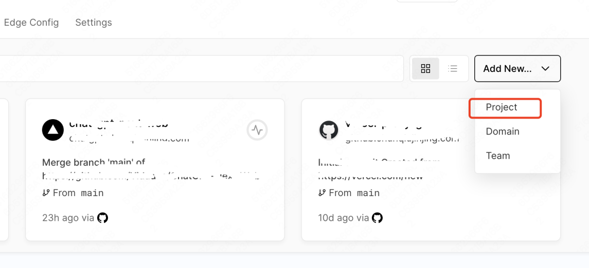
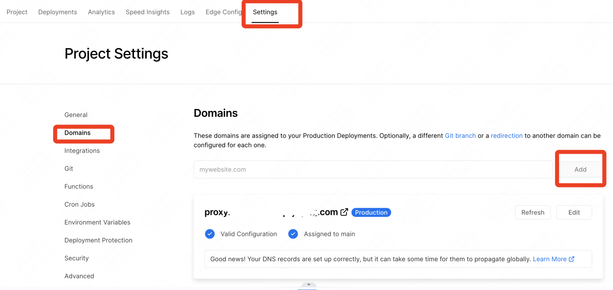
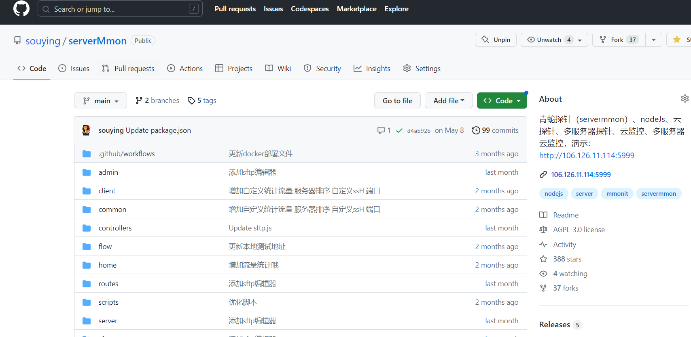
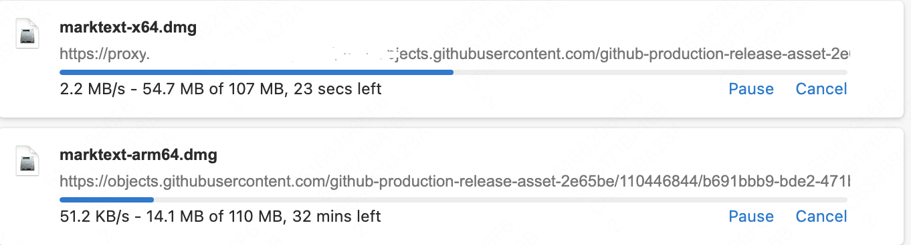
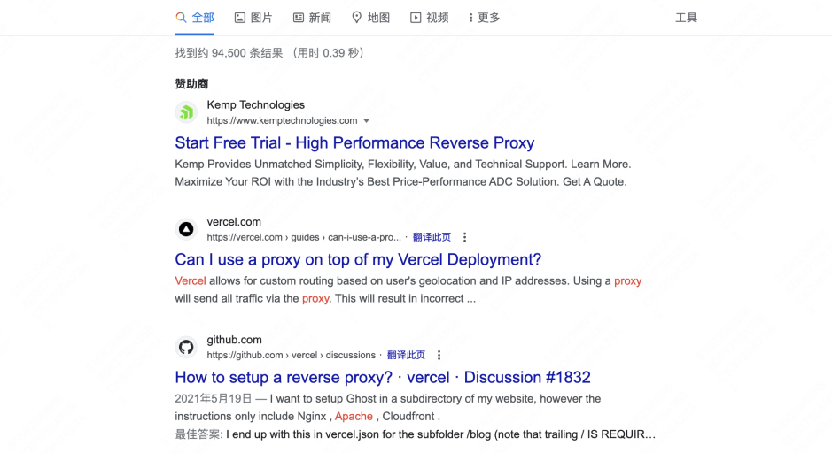

# vercel-api-proxy
[English README](./README_EN.md)    

----------------------------------------------------------------------------------------------------------------------------------------------------------------  
Telegram免费代理：  

免费送高速代理规则:    
每分享一个人使用代理，可增加自己使用时间5天    
怎么算分享成功呢？      

你只需要把高速代理链接复制分享给需要的人，他开启使用后，你的代理免费使用时间就会自动增5天    

tg://proxy?server=23.142.200.64&port=20020&secret=ee660371158145253e06e5355bf40f5e3c617a7572652e6d6963726f736f66742e636f6d    

tg://proxy?server=23.142.200.64&port=20021&secret=ee66c371858445a53e06e5355bf40f8e5b617a7572652e6d6963726f736f66742e636f6d       

tg://proxy?server=23.142.200.64&port=20022&secret=ee4111911bedcc4e6eab41dea7c22b3c2c617a7572652e6d6963726f736f66742e636f6d    

----------------------------------------------------------------------------------------------------------------------------------------------------------------   

本项目是vercel反向代理。完全免费，万能代理，可代理全网一切接口，包括openai、Midjourney、github、google、Telegram等等。http和https接口、单页面均可代理，在网络环境不好的情况下均可用。（直接浏览器打开代理页面的情况下，由于某些js和css的路径可能会不对造成访问不到不会有大的影响。）     

(openai等接口服务大陆机器也可无需科学上网环境很稳定ip也稳定)    

(可强开QQ红域名)    

vercel现在每月有100GB的免费流量。 

This project is a Reverse proxy of vercel. Completely free, universal proxy, capable of representing all network interfaces, including openai, Midjournal, github, Google, Telegram, and more. Both HTTP and HTTPS interfaces, as well as single page proxies, are available in poor network environments. (In the case of directly opening the proxy page in the browser, the path of certain JS and CSS may not be correct, which will not have a significant impact on access.)    

(OpenAI and other interface services can also be provided to mainland machines without the need for scientific internet access. The environment is very stable and the IP is also stable.)     

(Can forcibly open QQ red domain names)    

Vercel now has 100GB of free traffic per month.   

## 请您Star/Please Star   

如果您觉得此工具不错，请轻轻点击此页面右上角**Star**按钮增加项目曝光度，谢谢！软件完全免费（商用除外），只求大家Star和宣传给其他需要的朋友，谢谢！   

If you think this tool is good, please gently click the **Star** button in the upper right corner at this page to increase the project exposure, thank you! The software is completely free (except for commercial use), only ask everyone to Star and promote it to other friends in need, thank you!    

## 部署

## 使用方法
1 部署。部署有两种方法，一是直接点击上方按钮一键部署，二是可以先fork本项目，再登录[vercel](https://vercel.com/)网站新建

2 绑定自己的域名(不是必须，使用vercel自带的子域名也可以，但是自带的域名vercel.app在国内网络环境不好的情况下不可用) 可以申请[tk免费域名](http://www.dot.tk/)或者薅小域名注册商首年免费羊毛

绑定域名时按照vercel上的说明配置即可，其实就是在你的域名上配了一个子域名，cname到vercel服务器

3 访问 域名/https/url  或者/http/url即可。
映射规则为/https/url映射到https接口，/http/url映射到http接口

## 示例
例1     
访问https://替换为你自己的域名/https/api.openai.com/v1/chat/completions 
实际上会替换为https://api.openai.com/v1/chat/completions

如何在一些常见的开源项目中使用？
一般开源项目都是引用的openai的库，可以看到里面有一个属性是api_base = os.environ.get("OPENAI_API_BASE", "https://api.openai.com/v1")

所以使用的时候只需要设置一下openai.api_base="https://你的域名/https/api.openai.com/v1" 就可以了

例2   
访问https://你的域名/https/github.com/souying/serverMmon/
实际上会替换为https://github.com/souying/serverMmon/

映射规则为/https/url映射到https接口，/http/url映射到http接口

也可用于github下载加速。假如原始链接是https://objects.githubusercontent.com/github-production-release-asset-2e65be/xxxxxx 
改为https://替换为你自己的域名.com/https/objects.githubusercontent.com/github-production-release-asset-2e65be/xxxxxx 就可以加速了。下图是github原始链接和加速后对比。可以看到效果杠杠的，每秒50kb小水管变成了每秒2-3mb

例3    
访问https://你的域名/https/www.google.com/search?q=vercel-api-proxy
实际上会替换为https://www.google.com/search?q=vercel-api-proxy

代理google搜索结果页面
